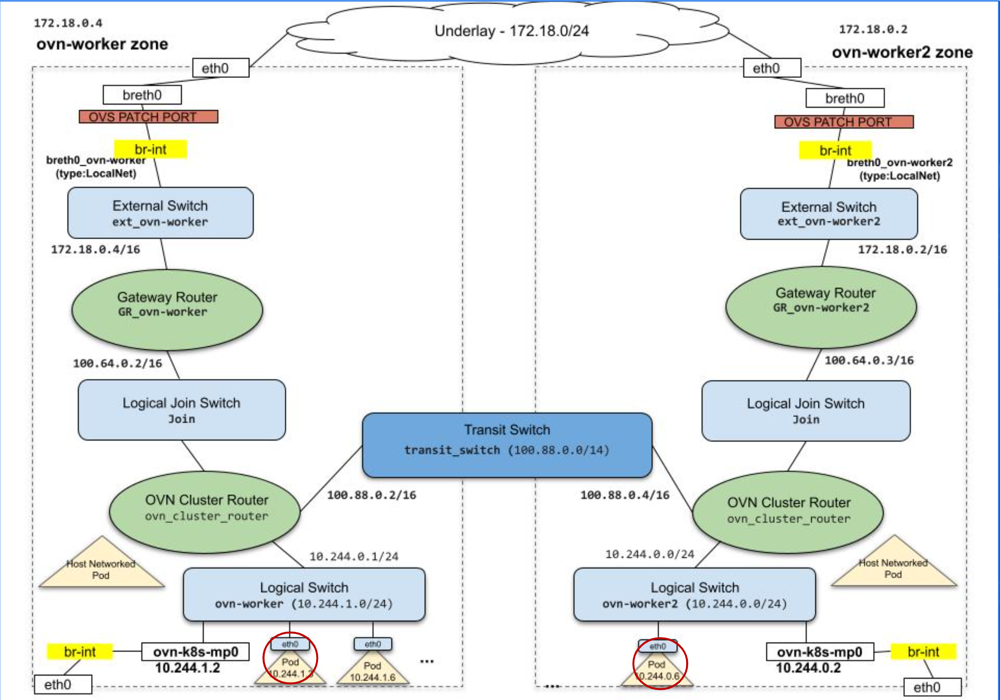

# OpenShift Network Tracing

## Table of Contents

- [Overview](#overview)
- [Contents](#contents)
  - [Dockerfile](#dockerfile)
  - [YAML Manifests](#yaml-manifests)
- [Configuration](#configuration)
  - [Building the Networking Tools Container](#building-the-networking-tools-container)
  - [Pushing the Image to Quay](#pushing-the-image-to-quay)
  - [Deploying the Test Application](#deploying-the-test-application)
- [Tracing](#tracing)
  - [Container-to-Container Communication](#container-to-container-communication)
    - [Shared Network Namespace](#shared-network-namespace)
    - [Process Isolation](#process-isolation)
    - [Filesystem Isolation](#filesystem-isolation)
    - [Connection Tracking with conntrack](#connection-tracking-with-conntrack)
    - [Packet Capture with tcpdump](#packet-capture-with-tcpdump)
    - [Summary](#summary)
  - [Understanding the Node Network Stack](#understanding-the-node-network-stack)
    - [OVS Topology on a Physical Node](#ovs-topology-on-a-physical-node)
    - [Container, Veth Pair, and Physical NIC](#container-veth-pair-and-physical-nic)
    - [Comparing Capture Points: veth, eth0, and Physical NIC](#comparing-capture-points-veth-eth0-and-physical-nic)
    - [Summary](#summary-1)
  - [Tracing a Packet from Pod to the Internet](#tracing-a-packet-from-pod-to-the-internet)
    - [Packet Path Overview](#packet-path-overview)
    - [Prerequisites](#prerequisites)
    - [Step 1: Capture at Pod eth0](#step-1-capture-at-pod-eth0)
    - [Step 2: Find the Host-Side veth](#step-2-find-the-host-side-veth)
    - [Step 3: Capture at Host veth](#step-3-capture-at-host-veth)
    - [Step 4: Capture at Physical NIC (SNAT Observed)](#step-4-capture-at-physical-nic-snat-observed)
    - [Step 5: Verify with conntrack on the Node](#step-5-verify-with-conntrack-on-the-node)
    - [Step 6: Confirm the OVN SNAT Rule](#step-6-confirm-the-ovn-snat-rule)
    - [Step 7: Capture at the Bastion Host (Second SNAT)](#step-7-capture-at-the-bastion-host-second-snat)
    - [Summary](#summary-2)
  - [Tracing a Packet from Pod to Pod (different node)](#tracing-a-packet-from-pod-to-pod-different-node)
    - [Step 1: Confirm pods on different nodes](#step-1-confirm-pods-on-different-nodes)
    - [Step 2: Describe ovnkube-node (what runs on the node)](#step-2-describe-ovnkube-node-what-runs-on-the-node)
    - [Step 3: nbdb vs sbdb](#step-3-nbdb-vs-sbdb)
- [Requirements](#requirements)
- [Notes](#notes)
- [References](#references)

## Overview

This directory provides a comprehensive set of tools for network analysis, packet capture, and troubleshooting in OpenShift environments. It includes a container image with essential networking tools and example YAML manifests for deploying network test scenarios.

## Contents

### Dockerfile

The `Dockerfile` builds a container image based on Fedora that installs packages for packet capture and protocol decoding (`tcpdump`, `wireshark-cli`), connection tracking (`conntrack-tools`), IP/DNS/routing and L2 tooling (`iproute`, `iputils`, `bind-utils`, `net-tools`, `bridge-utils`, `ethtool`), HTTP and general connectivity testing (`curl`, `wget`, `nmap-ncat`, `nc`, `iperf3`, `nmap`, `traceroute`, `telnet`, `socat`), interface and process monitoring (`iftop`, `iotop`, `htop`, `mtr`), process and syscall inspection (`procps-ng`, `lsof`, `strace`), and shell conveniences (`bash-completion`, `vim`, `less`).

### YAML Manifests

#### http-svc.yaml

A complete OpenShift application manifest that includes:
- **ConfigMap** (`static-content`) - Sample static content
- **ConfigMap** (`nginx-config`) - Nginx server configuration
- **Deployment** (`static-server`) - Nginx-based static content server
- **Service** (`static-server`) - ClusterIP service exposing the deployment
- **Routes** - HTTP and HTTPS routes for external access

This manifest can be used to:
- Test network connectivity between pods and services
- Verify route functionality
- Create a test endpoint for network tracing exercises

#### dual-container.yaml

A Pod manifest that creates a single pod with two containers sharing the same network namespace, designed for container-to-container communication tracing:
- **Pod** (`nettools-dual-pod`) - Contains two `nettools-fedora` containers
- **Container 1** (`nettools-container-1`) - Runs a Python HTTP server on port 8080 serving content from `/tmp`
- **Container 2** (`nettools-container-2`) - Runs `sleep infinity` for interactive access
- Both containers run with a privileged security context and share the same pod network namespace

Used for network tracing exercises to capture and analyze HTTP traffic between containers within the same pod.

## Configuration

### Building the Networking Tools Container

```bash
# Build the container image
podman build -t nettools-fedora:latest .
```

### Pushing the Image to Quay

```bash
# Tag the image
podman tag localhost/nettools-fedora:latest quay.io/<your-username>/nettools-fedora:latest

# Push the image to the remote registry
podman push quay.io/<your-username>/nettools-fedora:latest
```

### Deploying the Test Application

```bash
# Deploy the HTTP service for testing
oc apply -f http-svc.yaml
```

```bash
# Deploy a pod with two containers
oc apply -f dual-container.yaml
```

---

## Tracing

### Container-to-Container Communication

Once we have deployed the dual-container pod, we should see the following pod running:

```bash
$ oc get pod -n network-trace | grep dual
nettools-dual-pod                2/2     Running   0          5d22h
```

#### Shared Network Namespace

Since containers within the same pod share a network namespace, their NIC and MAC addresses are identical.

**Container 1:**
```bash
$ oc rsh -c nettools-container-1 -n network-trace nettools-dual-pod
sh-5.1# ip a
1: lo: <LOOPBACK,UP,LOWER_UP> mtu 65536 qdisc noqueue state UNKNOWN group default qlen 1000
    link/loopback 00:00:00:00:00:00 brd 00:00:00:00:00:00
    inet 127.0.0.1/8 scope host lo
       valid_lft forever preferred_lft forever
    inet6 ::1/128 scope host 
       valid_lft forever preferred_lft forever
2: eth0@if4615: <BROADCAST,MULTICAST,UP,LOWER_UP> mtu 1400 qdisc noqueue state UP group default 
    link/ether 0a:58:0a:80:02:2b brd ff:ff:ff:ff:ff:ff link-netnsid 0
    inet 10.128.2.43/23 brd 10.128.3.255 scope global eth0
       valid_lft forever preferred_lft forever
    inet6 fe80::858:aff:fe80:22b/64 scope link 
       valid_lft forever preferred_lft forever
```

**Container 2:**
```bash
$ oc rsh -c nettools-container-2 -n network-trace nettools-dual-pod
sh-5.1# ip a
1: lo: <LOOPBACK,UP,LOWER_UP> mtu 65536 qdisc noqueue state UNKNOWN group default qlen 1000
    link/loopback 00:00:00:00:00:00 brd 00:00:00:00:00:00
    inet 127.0.0.1/8 scope host lo
       valid_lft forever preferred_lft forever
    inet6 ::1/128 scope host 
       valid_lft forever preferred_lft forever
2: eth0@if4615: <BROADCAST,MULTICAST,UP,LOWER_UP> mtu 1400 qdisc noqueue state UP group default 
    link/ether 0a:58:0a:80:02:2b brd ff:ff:ff:ff:ff:ff link-netnsid 0
    inet 10.128.2.43/23 brd 10.128.3.255 scope global eth0
       valid_lft forever preferred_lft forever
    inet6 fe80::858:aff:fe80:22b/64 scope link 
       valid_lft forever preferred_lft forever
```

Both containers report the same `eth0@if4615` with IP `10.128.2.43` and MAC `0a:58:0a:80:02:2b`, confirming the shared network namespace.

#### Process Isolation

Although the network namespace is shared, each container has its own process namespace. Container 2 can only see `sleep infinity`, while Container 1 can only see the Python HTTP server:

**Container 2:**
```bash
$ oc rsh -c nettools-container-2 -n network-trace nettools-dual-pod
sh-5.1# ps aux
USER         PID %CPU %MEM    VSZ   RSS TTY      STAT START   TIME COMMAND
root           1  0.0  0.0   2624  1024 ?        Ss   Nov17   0:00 sleep infinity
root          13  0.0  0.0   4424  3584 pts/0    Ss   02:08   0:00 /bin/sh
root          14  0.0  0.0   7008  2560 pts/0    R+   02:08   0:00 ps aux
```

**Container 1:**
```bash
$ oc rsh -c nettools-container-1 -n network-trace nettools-dual-pod
sh-5.1# ps aux
USER         PID %CPU %MEM    VSZ   RSS TTY      STAT START   TIME COMMAND
root           1  0.0  0.0  96720 16384 ?        Ss   Nov17   0:12 python3 -m http.server 8080
root           8  0.0  0.0   4424  3584 pts/0    Ss   02:08   0:00 /bin/sh
root           9  0.0  0.0   7008  2560 pts/0    R+   02:09   0:00 ps aux
```

#### Filesystem Isolation

Each container also has its own filesystem. Create a file in Container 1 and verify it does not appear in Container 2:

**Container 1:**
```bash
$ oc rsh -c nettools-container-1 -n network-trace nettools-dual-pod
sh-5.1# echo "container 1" >> /tmp/container-1.txt
sh-5.1# cat /tmp/container-1.txt 
container 1
```

**Container 2:**
```bash
$ oc rsh -c nettools-container-2 -n network-trace nettools-dual-pod
sh-5.1# ls /tmp/
sh-5.1# 
```

The file does not exist in Container 2, confirming filesystem isolation.

#### Connection Tracking with conntrack

Use `conntrack -E` to watch real-time connection events. Start the event listener in Container 1, then curl the HTTP server from Container 2:

**Container 1 (listener):**
```bash
$ oc rsh -c nettools-container-1 -n network-trace nettools-dual-pod
sh-5.1# conntrack -E
    [NEW] tcp      6 120 SYN_SENT src=127.0.0.1 dst=127.0.0.1 sport=51000 dport=8080 [UNREPLIED] src=127.0.0.1 dst=127.0.0.1 sport=8080 dport=51000
 [UPDATE] tcp      6 60 SYN_RECV src=127.0.0.1 dst=127.0.0.1 sport=51000 dport=8080 src=127.0.0.1 dst=127.0.0.1 sport=8080 dport=51000
 [UPDATE] tcp      6 432000 ESTABLISHED src=127.0.0.1 dst=127.0.0.1 sport=51000 dport=8080 src=127.0.0.1 dst=127.0.0.1 sport=8080 dport=51000 [ASSURED]
 [UPDATE] tcp      6 120 FIN_WAIT src=127.0.0.1 dst=127.0.0.1 sport=51000 dport=8080 src=127.0.0.1 dst=127.0.0.1 sport=8080 dport=51000 [ASSURED]
 [UPDATE] tcp      6 30 LAST_ACK src=127.0.0.1 dst=127.0.0.1 sport=51000 dport=8080 src=127.0.0.1 dst=127.0.0.1 sport=8080 dport=51000 [ASSURED]
 [UPDATE] tcp      6 120 TIME_WAIT src=127.0.0.1 dst=127.0.0.1 sport=51000 dport=8080 src=127.0.0.1 dst=127.0.0.1 sport=8080 dport=51000 [ASSURED]
[DESTROY] tcp      6 TIME_WAIT src=127.0.0.1 dst=127.0.0.1 sport=49368 dport=8080 src=127.0.0.1 dst=127.0.0.1 sport=8080 dport=49368 [ASSURED]
[DESTROY] tcp      6 TIME_WAIT src=127.0.0.1 dst=127.0.0.1 sport=33924 dport=8080 src=127.0.0.1 dst=127.0.0.1 sport=8080 dport=33924 [ASSURED]
```

**Container 2 (client):**
```bash
$ oc rsh -c nettools-container-2 -n network-trace nettools-dual-pod
sh-5.1# curl http://127.0.0.1:8080/hello.txt
Hello World
```

Since both containers share the network namespace, Container 2 reaches Container 1's HTTP server via `127.0.0.1`. The conntrack output shows the full TCP lifecycle: `SYN_SENT` -> `SYN_RECV` -> `ESTABLISHED` -> `FIN_WAIT` -> `LAST_ACK` -> `TIME_WAIT` -> `DESTROY`.

#### Packet Capture with tcpdump

For packet-level details, start tcpdump on the loopback device in Container 1, then curl from Container 2:

**Container 1 (capture):**
```bash
$ oc rsh -c nettools-container-1 -n network-trace nettools-dual-pod
sh-5.1# tcpdump -i lo -nn -A 'port 8080 and (host 127.0.0.1)'
dropped privs to tcpdump
tcpdump: verbose output suppressed, use -v[v]... for full protocol decode
listening on lo, link-type EN10MB (Ethernet), snapshot length 262144 bytes

02:32:28.679560 IP 127.0.0.1.39630 > 127.0.0.1.8080: Flags [S], seq 388646906, win 65495, options [mss 65495,sackOK,TS val 2431590157 ecr 0,nop,wscale 7], length 0
E..<..@.@................*G..........0.........
............
02:32:28.679581 IP 127.0.0.1.8080 > 127.0.0.1.39630: Flags [S.], seq 3084335693, ack 388646907, win 65483, options [mss 65495,sackOK,TS val 2431590157 ecr 2431590157,nop,wscale 7], length 0
E..<..@.@.<...............:M.*G......0.........
............
02:32:28.679593 IP 127.0.0.1.39630 > 127.0.0.1.8080: Flags [.], ack 1, win 512, options [nop,nop,TS val 2431590157 ecr 2431590157], length 0
E..4..@.@................*G...:N.....(.....
.......                      
02:32:28.679638 IP 127.0.0.1.39630 > 127.0.0.1.8080: Flags [P.], seq 1:88, ack 1, win 512, options [nop,nop,TS val 2431590157 ecr 2431590157], length 87: HTTP: GET /hello.txt HTTP/1.1
E.....@.@................*G...:N...........                                                                                                                                                                              
........GET /hello.txt HTTP/1.1
Host: 127.0.0.1:8080
User-Agent: curl/7.82.0
Accept: */*


02:32:28.679642 IP 127.0.0.1.8080 > 127.0.0.1.39630: Flags [.], ack 88, win 511, options [nop,nop,TS val 2431590157 ecr 2431590157], length 0
E..4T.@.@.................:N.*HR.....(.....
.......
02:32:28.681580 IP 127.0.0.1.8080 > 127.0.0.1.39630: Flags [P.], seq 1:187, ack 88, win 512, options [nop,nop,TS val 2431590159 ecr 2431590157], length 186: HTTP: HTTP/1.0 200 OK
E...T.@.@..5..............:N.*HR...........
........HTTP/1.0 200 OK
Server: SimpleHTTP/0.6 Python/3.10.4
Date: Tue, 18 Nov 2025 02:32:28 GMT
Content-type: text/plain
Content-Length: 12
Last-Modified: Mon, 17 Nov 2025 08:08:08 GMT
02:32:28.681608 IP 127.0.0.1.39630 > 127.0.0.1.8080: Flags [.], ack 187, win 511, options [nop,nop,TS val 2431590159 ecr 2431590159], length 0
E..4..@.@................*HR..;......(.....
........
02:32:28.681675 IP 127.0.0.1.8080 > 127.0.0.1.39630: Flags [P.], seq 187:199, ack 88, win 512, options [nop,nop,TS val 2431590159 ecr 2431590159], length 12: HTTP
E..@T.@.@.................;..*HR.....4.....
........Hello World

02:32:28.681684 IP 127.0.0.1.39630 > 127.0.0.1.8080: Flags [.], ack 199, win 511, options [nop,nop,TS val 2431590159 ecr 2431590159], length 0
E..4..@.@................*HR..;......(.....
........
02:32:28.681774 IP 127.0.0.1.8080 > 127.0.0.1.39630: Flags [F.], seq 199, ack 88, win 512, options [nop,nop,TS val 2431590159 ecr 2431590159], length 0
E..4T.@.@.................;..*HR.....(.....
........
02:32:28.681894 IP 127.0.0.1.39630 > 127.0.0.1.8080: Flags [F.], seq 88, ack 200, win 512, options [nop,nop,TS val 2431590159 ecr 2431590159], length 0
E..4..@.@................*HR..;......(.....
........
02:32:28.681934 IP 127.0.0.1.8080 > 127.0.0.1.39630: Flags [.], ack 89, win 512, options [nop,nop,TS val 2431590159 ecr 2431590159], length 0
E..4T.@.@.................;..*HS.....(.....
........
^C
12 packets captured
24 packets received by filter
0 packets dropped by kernel
```

**Container 2 (client):**
```bash
$ oc rsh -c nettools-container-2 -n network-trace nettools-dual-pod
sh-5.1# curl http://127.0.0.1:8080/hello.txt
Hello World
```

The tcpdump output shows the complete HTTP transaction over TCP: the three-way handshake (`[S]`, `[S.]`, `[.]`), the `GET /hello.txt` request, the `200 OK` response with `Hello World`, and the connection teardown (`[F.]`). All traffic flows over loopback (`127.0.0.1`) since both containers share the same network namespace.

#### Summary

In a multi-container pod, **one network namespace** means a **single** pod IP, **`eth0`**, and port space—containers talk to each other like processes on the same host (here via **`127.0.0.1`**). **Process** and **filesystem** namespaces stay **per container**, so isolation is not “all or nothing.” **`conntrack`** and **`tcpdump`** on **`lo`** (or **`eth0`**) show the same flows from the shared stack.

---

### Understanding the Node Network Stack

#### OVS Topology on a Physical Node

The OVS topology on a node consists of two bridges. `br-ex` connects to the physical NIC (`ens2f0np0`) and includes 3 ports. `br-int` has N ports that connect all the containers via veth pairs:

```bash
sh-5.1# ovs-vsctl show
cbab9023-5b75-43cc-93fd-61db4e0d387f
    Bridge br-ex
        Port ens2f0np0
            Interface ens2f0np0
                type: system
        Port br-ex
            Interface br-ex
                type: internal
        Port patch-br-ex_m42-h32-000-r650-to-br-int
            Interface patch-br-ex_m42-h32-000-r650-to-br-int
                type: patch
                options: {peer=patch-br-int-to-br-ex_m42-h32-000-r650}
    Bridge br-int
        fail_mode: secure
        datapath_type: system
        Port "7be093806debefd"
            Interface "7be093806debefd"
        Port "4952fbdba0f3a02"
            Interface "4952fbdba0f3a02"
        ...
        [~150 more container veth interfaces]
        ...
        Port patch-br-int-to-br-ex_m42-h32-000-r650
            Interface patch-br-int-to-br-ex_m42-h32-000-r650
                type: patch
                options: {peer=patch-br-ex_m42-h32-000-r650-to-br-int}
        Port ovn-k8s-mp0
            Interface ovn-k8s-mp0
                type: internal
        Port ovn-91667b-0
            Interface ovn-91667b-0
                type: geneve
                options: {csum="true", key=flow, local_ip="198.18.0.9", remote_ip="198.18.0.7"}
        Port ovn-ae72c2-0
            Interface ovn-ae72c2-0
                type: geneve
                options: {csum="true", key=flow, local_ip="198.18.0.9", remote_ip="198.18.0.8"}
        ...
        [3 more Geneve tunnels to nodes .5, .6, .10]
        ...
        Port br-int
            Interface br-int
                type: internal
    ovs_version: "3.4.3-66.el9fdp"
```

Here is a high-level diagram of the two bridges and the ports connected to them:

```
External Network/Internet
        |
        | (Ethernet cable plugged into Port 1)
        v
+---------------------------------------+
|       Switch: br-ex                   |
|       (3-port switch)                 |
|                                       |
|  [Port 1]  [Port 2]  [Port 3]       |
|     |         |         |             |
|     |         |         +--------+    |
|  ens2f0np0  br-ex            patch   |
|  (physical) (virtual)      (virtual) |
+-------------------------------+------+
                                |
                  Virtual Patch Cable
                  (like an Ethernet cable)
                                |
+-------------------------------+------+
|       Switch: br-int                 |
|       (157-port switch)              |
|                                      |
|  [Port 1] [Port 2] [Port 3] ... [N] |
|     |        |        |              |
|   patch    veth1    veth2    ... more |
|  (from     (to      (to             |
|   br-ex)   pod-1)   pod-2)          |
+----------+---------+----------------+
           |         |
       Container1  Container2  ... (~150 containers)
```

#### Container, Veth Pair, and Physical NIC

This section demonstrates how to trace the connection between a container's network interface, its host-side veth pair, and the physical NIC on the node.

**Find the node where the pod is running:**

```bash
$ oc get pod -o wide -n network-trace 
NAME                             READY   STATUS    RESTARTS   AGE   IP             NODE               NOMINATED NODE   READINESS GATES
nettools-dual-pod                2/2     Running   0          15d   10.128.2.43    m42-h32-000-r650   <none>           <none>
```

**Verify connectivity from the node to the pod:**

```bash
$ oc debug node/m42-h32-000-r650
sh-5.1# chroot /host
sh-5.1# curl http://10.128.2.43:8080/hello.txt
Hello World
```

**Use `crictl` to find the containers running on this host:**

```bash
sh-5.1# crictl ps | grep dual
da7e98b24503f  quay.io/rh_ee_lguoqing/nettools-fedora@sha256:...  2 weeks ago  Running  nettools-container-2  0  7be093806debe  nettools-dual-pod
b5ec119e63fa6  quay.io/rh_ee_lguoqing/nettools-fedora@sha256:...  2 weeks ago  Running  nettools-container-1  0  7be093806debe  nettools-dual-pod
```

**Examine the network namespace of this pod:**

```bash
sh-5.1# crictl inspectp 7be093806debe | jq -r '.info.runtimeSpec.linux.namespaces[] | select(.type=="network").path'
/var/run/netns/67f12702-ca28-499f-b79f-e317ce158fe2
```

**Enter that network namespace and examine the network interfaces.** We see `eth0@if4615`, which tells us that this eth0 interface is connected to interface index 4615 on the other side -- in this case, an interface on the host:

```bash
sh-5.1# nsenter --net=/var/run/netns/67f12702-ca28-499f-b79f-e317ce158fe2
[root@m42-h32-000-r650 /]# ip a
1: lo: <LOOPBACK,UP,LOWER_UP> mtu 65536 qdisc noqueue state UNKNOWN group default qlen 1000
    link/loopback 00:00:00:00:00:00 brd 00:00:00:00:00:00
    inet 127.0.0.1/8 scope host lo
       valid_lft forever preferred_lft forever
    inet6 ::1/128 scope host 
       valid_lft forever preferred_lft forever
2: eth0@if4615: <BROADCAST,MULTICAST,UP,LOWER_UP> mtu 1400 qdisc noqueue state UP group default 
    link/ether 0a:58:0a:80:02:2b brd ff:ff:ff:ff:ff:ff link-netns b4c80c54-362d-405e-8c54-a170a7de8386
    inet 10.128.2.43/23 brd 10.128.3.255 scope global eth0
       valid_lft forever preferred_lft forever
    inet6 fe80::858:aff:fe80:22b/64 scope link 
       valid_lft forever preferred_lft forever
```

**Find the host-side veth by grepping for the interface index.** The container-side `2: eth0@if4615` pairs with `4615: 7be093806debefd@if2`. Note that the interface name matches the pod sandbox ID. See [[1]](#references) for more information on Linux virtual interfaces:

```bash
sh-5.1# ip link show | grep 4615
4615: 7be093806debefd@if2: <BROADCAST,MULTICAST,UP,LOWER_UP> mtu 1400 qdisc noqueue master ovs-system state UP mode DEFAULT group default 
```

The output also shows that veth 4615 is enslaved by a master called `ovs-system`. The details of this interface confirm it is an Open vSwitch [[2]](#references) interface, not a standard Linux network interface. The OVN-Kubernetes [[3]](#references) architecture diagram shows how OVS fits into the picture:

```bash
sh-5.1# ip -d link show ovs-system
11: ovs-system: <BROADCAST,MULTICAST> mtu 1500 qdisc noop state DOWN mode DEFAULT group default qlen 1000
    link/ether e2:43:fd:d1:2e:58 brd ff:ff:ff:ff:ff:ff promiscuity 1  allmulti 0 minmtu 68 maxmtu 65535 
    openvswitch addrgenmode eui64 numtxqueues 1 numrxqueues 1 gso_max_size 65536 gso_max_segs 65535 tso_max_size 65536 tso_max_segs 65535 gro_max_size 65536 gso_ipv4_max_size 65536 gro_ipv4_max_size 65536
```

There are 3 devices associated with `ovs-system`: `ens2f0np0` (the physical NIC), `ovs-system` itself, and `genev_sys_6081` (for Geneve tunneling):

```bash
sh-5.1# ip link show | grep "ovs-system" | grep -v "@if"
8: ens2f0np0: <BROADCAST,MULTICAST,UP,LOWER_UP> mtu 1500 qdisc mq master ovs-system state UP mode DEFAULT group default qlen 1000
11: ovs-system: <BROADCAST,MULTICAST> mtu 1500 qdisc noop state DOWN mode DEFAULT group default qlen 1000
14: genev_sys_6081: <BROADCAST,MULTICAST,UP,LOWER_UP> mtu 65000 qdisc noqueue master ovs-system state UNKNOWN mode DEFAULT group default qlen 1000
```

#### Comparing Capture Points: veth, eth0, and Physical NIC

Now let's capture packets at three different points to observe how the source IP changes as a packet leaves the pod.

**Capture on the host-side veth port:**

```bash
$ oc debug node/m42-h32-000-r650
sh-5.1# tcpdump -i 7be093806debefd -n
listening on 7be093806debefd, link-type EN10MB (Ethernet), snapshot length 262144 bytes
04:50:13.113152 IP 10.128.2.43 > 8.8.8.8: ICMP echo request, id 15, seq 1, length 64
04:50:13.127747 IP 8.8.8.8 > 10.128.2.43: ICMP echo reply, id 15, seq 1, length 64
04:50:18.590973 ARP, Request who-has 10.128.2.1 tell 10.128.2.43, length 28
04:50:18.591379 ARP, Reply 10.128.2.1 is-at 0a:58:a9:fe:01:01, length 28
```

**Capture on the container's eth0:**

```bash
$ oc rsh nettools-dual-pod
sh-5.1# tcpdump -i eth0 -n
listening on eth0, link-type EN10MB (Ethernet), snapshot length 262144 bytes
04:50:13.113137 IP 10.128.2.43 > 8.8.8.8: ICMP echo request, id 15, seq 1, length 64
04:50:13.127754 IP 8.8.8.8 > 10.128.2.43: ICMP echo reply, id 15, seq 1, length 64
04:50:18.590915 ARP, Request who-has 10.128.2.1 tell 10.128.2.43, length 28
04:50:18.591382 ARP, Reply 10.128.2.1 is-at 0a:58:a9:fe:01:01, length 28
```

**Capture on the physical NIC:**

```bash
$ oc debug node/m42-h32-000-r650
sh-5.1# tcpdump icmp -i ens2f0np0 -n
listening on ens2f0np0, link-type EN10MB (Ethernet), snapshot length 262144 bytes
04:50:13.115888 IP 198.18.0.9 > 8.8.8.8: ICMP echo request, id 15, seq 1, length 64
04:50:13.124988 IP 8.8.8.8 > 198.18.0.9: ICMP echo reply, id 15, seq 1, length 64
```

**Send an ICMP packet from inside the pod's network namespace:**

```bash
$ oc debug node/m42-h32-000-r650
sh-5.1# chroot /host
sh-5.1# nsenter --net=/var/run/netns/67f12702-ca28-499f-b79f-e317ce158fe2
[root@m42-h32-000-r650 /]# ping 8.8.8.8 -c 1
PING 8.8.8.8 (8.8.8.8) 56(84) bytes of data.
64 bytes from 8.8.8.8: icmp_seq=1 ttl=107 time=14.5 ms

--- 8.8.8.8 ping statistics ---
1 packets transmitted, 1 received, 0% packet loss, time 0ms
rtt min/avg/max/mdev = 14.507/14.507/14.507/0.000 ms
```

The tcpdump output on the host-side veth and the container's eth0 looks almost identical, which is exactly what we expect for a veth pair -- can you spot the difference? (Hint: look at the timestamps.)

On the physical NIC, however, the source IP changed from `10.128.2.43` to `198.18.0.9`, indicating that SNAT is being performed at the OVN layer. [Tracing a Packet from Pod to the Internet](#tracing-a-packet-from-pod-to-the-internet) walks through this transformation step by step.

#### Summary

On each node, **OVS** splits the datapath into **`br-ex`** (physical NIC, patch to the other bridge) and **`br-int`** (pod **veth** ports, **Geneve** tunnels to other nodes, and related ports). A pod’s **`eth0`** is one end of a **veth**; the host end is attached to **`br-int`** via **OVN-Kubernetes**, not a plain Linux bridge. **Captures on the pod’s `eth0` and on the host-side veth** show the **pod IP** and nearly the same traffic (timestamps differ slightly across the pair). **Captures on the physical NIC** show **SNAT** to the node’s **gateway** address for traffic leaving the cluster path—so where you tap determines whether you see **overlay/pod addressing** or **post-NAT** addresses.

---

## Tracing a Packet from Pod to the Internet

This exercise walks through tracing an ICMP packet from a pod all the way to the internet, capturing it at every network hop to observe exactly where SNAT (Source Network Address Translation) occurs. In this lab environment, the packet undergoes **two SNATs**: first by the OVN gateway router on the node, then by the bastion host that routes the cluster to the external network. By the end, you will see how the pod IP transforms at each hop.

### Packet Path Overview

```
Pod eth0 (10.128.2.43)
    |
    v
Host veth 7be093806debefd (10.128.2.43)    <-- still pod IP
    |
    v
OVS br-int
    | patch port
    v
OVS br-ex -- OVN Gateway Router performs SNAT #1 here
    |
    v
Node physical NIC ens2f0np0 (198.18.0.9)   <-- node IP (1st SNAT)
    |
    v  198.18.0.0/16 network
    |
Bastion ens2f0np0 (198.18.0.1)             <-- receives packet with node IP
    |
    v  iptables MASQUERADE performs SNAT #2
    |
Bastion eno12399 (10.6.62.29)              <-- bastion IP (2nd SNAT)
    |
    v  10.6.62.0/24 lab network -> default gateway 10.6.62.254
    |
Internet (8.8.8.8)
```

A quick `traceroute` from the pod confirms this path:

```bash
$ oc exec -n network-trace nettools-dual-pod -c nettools-container-1 -- traceroute -n 8.8.8.8
traceroute to 8.8.8.8 (8.8.8.8), 30 hops max, 60 byte packets
 1  8.8.8.8  3.542 ms  3.671 ms  3.754 ms
 2  100.64.0.6  5.959 ms  5.990 ms  5.901 ms
 3  198.18.0.1  7.508 ms  7.617 ms  7.469 ms
 4  10.6.62.252  14.337 ms 10.6.62.253  13.058 ms  12.865 ms
 ...
18  8.8.8.8  11.200 ms  11.046 ms  8.848 ms
```

- **Hop 1:** OVN distributed gateway router (shows destination IP due to OVN's internal TTL handling)
- **Hop 2:** `100.64.0.6` -- OVN join network (the internal link between the logical switch and the gateway router)
- **Hop 3:** `198.18.0.1` -- the bastion host, acting as the default gateway for the cluster network
- **Hop 4+:** lab network routers (`10.6.62.x`) and beyond to `8.8.8.8`

The following steps capture and examine the packet at each of these hops in detail.

### Prerequisites

Identify the pod, its IP address, the node it runs on, and its network interface index:

```bash
$ oc get pod nettools-dual-pod -n network-trace -o wide
NAME                READY   STATUS    RESTARTS   AGE   IP            NODE               NOMINATED NODE   READINESS GATES
nettools-dual-pod   2/2     Running   0          87d   10.128.2.43   m42-h32-000-r650   <none>           <none>
```

Note the key values:
- **Pod IP**: `10.128.2.43`
- **Node**: `m42-h32-000-r650`

Check the pod's eth0 interface to find the peer interface index:

```bash
$ oc exec -n network-trace nettools-dual-pod -c nettools-container-1 -- ip addr show eth0
2: eth0@if4615: <BROADCAST,MULTICAST,UP,LOWER_UP> mtu 1400 qdisc noqueue state UP group default
    link/ether 0a:58:0a:80:02:2b brd ff:ff:ff:ff:ff:ff link-netnsid 0
    inet 10.128.2.43/23 brd 10.128.3.255 scope global eth0
       valid_lft forever preferred_lft forever
```

The `@if4615` suffix tells us the host-side veth has interface index **4615**.

Check the pod's routing table to confirm the default gateway:

```bash
$ oc exec -n network-trace nettools-dual-pod -c nettools-container-1 -- ip route
default via 10.128.2.1 dev eth0
10.128.0.0/14 via 10.128.2.1 dev eth0
10.128.2.0/23 dev eth0 proto kernel scope link src 10.128.2.43
100.64.0.0/16 via 10.128.2.1 dev eth0
172.30.0.0/16 via 10.128.2.1 dev eth0
```

All traffic to external destinations goes through the default gateway `10.128.2.1` via `eth0`.

### Step 1: Capture at Pod eth0

Start a tcpdump listener on one container while pinging from the other. Since both containers share the same network namespace, either one can capture:

```bash
# Terminal 1 - start tcpdump in container-2
$ oc exec -n network-trace nettools-dual-pod -c nettools-container-2 -- \
    tcpdump -i eth0 icmp -nn -c 2

# Terminal 2 - ping from container-1
$ oc exec -n network-trace nettools-dual-pod -c nettools-container-1 -- \
    ping -c 1 8.8.8.8
```

**Output (tcpdump):**
```
listening on eth0, link-type EN10MB (Ethernet), snapshot length 262144 bytes
14:56:58.356722 IP 10.128.2.43 > 8.8.8.8: ICMP echo request, id 36, seq 1, length 64
14:56:58.367488 IP 8.8.8.8 > 10.128.2.43: ICMP echo reply, id 36, seq 1, length 64
```

**Observation:** Source IP is `10.128.2.43` (pod IP). The packet leaves the pod with its original cluster-internal address.

### Step 2: Find the Host-Side veth

From the pod's `eth0@if4615`, we know the host-side interface has index 4615. Find it on the node:

```bash
$ oc debug node/m42-h32-000-r650 -- chroot /host bash -c "ip link | grep '^4615:'"
4615: 7be093806debefd@if2: <BROADCAST,MULTICAST,UP,LOWER_UP> mtu 1400 qdisc noqueue master ovs-system state UP mode DEFAULT group default
```

The host-side veth is `7be093806debefd`. Confirm which OVS bridge it belongs to:

```bash
$ oc debug node/m42-h32-000-r650 -- chroot /host bash -c "ovs-vsctl port-to-br 7be093806debefd"
br-int
```

The veth is a port on `br-int` (the integration bridge), which is the entry point into the OVS/OVN network on this node.

### Step 3: Capture at Host veth

Use `oc debug node/` to capture on host interfaces. The debug pod runs in the host network namespace and includes `tcpdump` in its default image. **Important:** do not run `chroot /host`, as that switches to the RHCOS host binaries where `tcpdump` is not installed:

```bash
# Terminal 1 - start tcpdump on the host veth (do NOT chroot /host)
$ oc debug node/m42-h32-000-r650
sh-5.1# tcpdump -i 7be093806debefd icmp -nn -c 2

# Terminal 2 - ping from the pod
$ oc exec -n network-trace nettools-dual-pod -c nettools-container-1 -- \
    ping -c 1 8.8.8.8
```

**Output (tcpdump):**
```
listening on 7be093806debefd, link-type EN10MB (Ethernet), snapshot length 262144 bytes
14:58:36.458762 IP 10.128.2.43 > 8.8.8.8: ICMP echo request, id 38, seq 1, length 64
14:58:36.477341 IP 8.8.8.8 > 10.128.2.43: ICMP echo reply, id 38, seq 1, length 64
```

**Observation:** Source IP is **still** `10.128.2.43`. The veth pair simply passes the packet between the pod network namespace and the host -- no address modification occurs here. The packet enters `br-int` with its original pod IP intact.

### Step 4: Capture at Physical NIC (SNAT Observed)

Now capture on the physical NIC `ens2f0np0`, which is a port on `br-ex`. This is where the packet exits the node toward the physical network:

```bash
# Terminal 1 - tcpdump on the physical NIC (do NOT chroot /host)
$ oc debug node/m42-h32-000-r650
sh-5.1# tcpdump -i ens2f0np0 icmp -nn -c 2

# Terminal 2 - ping from the pod
$ oc exec -n network-trace nettools-dual-pod -c nettools-container-1 -- \
    ping -c 1 8.8.8.8
```

**Output (tcpdump):**
```
listening on ens2f0np0, link-type EN10MB (Ethernet), snapshot length 262144 bytes
14:59:26.551786 IP 198.18.0.9 > 8.8.8.8: ICMP echo request, id 40, seq 1, length 64
14:59:26.561572 IP 8.8.8.8 > 198.18.0.9: ICMP echo reply, id 40, seq 1, length 64
```

**Observation:** The source IP changed from `10.128.2.43` to `198.18.0.9`. This is the node's `br-ex` IP address. The OVN gateway router performed SNAT between `br-int` and `br-ex`, replacing the pod IP with the node IP so the packet can be routed on the cluster network.

Where does the packet go next? The worker node's routing table tells us:

```bash
$ oc debug node/m42-h32-000-r650 -- chroot /host bash -c "ip route"
default via 198.18.0.1 dev br-ex proto static
10.128.0.0/14 via 10.128.2.1 dev ovn-k8s-mp0
10.128.2.0/23 dev ovn-k8s-mp0 proto kernel scope link src 10.128.2.2
169.254.0.0/17 dev br-ex proto kernel scope link src 169.254.0.2
169.254.0.1 dev br-ex src 198.18.0.9
172.30.0.0/16 via 169.254.0.4 dev br-ex src 169.254.0.2 mtu 1400
198.18.0.0/16 dev br-ex proto kernel scope link src 198.18.0.9 metric 48
```

The destination `8.8.8.8` does not match any specific route, so it hits the **default route**: `default via 198.18.0.1 dev br-ex`. The next hop `198.18.0.1` is the bastion host (`m42-h27-000-r650`), which acts as the gateway for the `198.18.0.0/16` cluster network.

### Step 5: Verify with conntrack on the Node

The kernel's connection tracking table on the worker node records the NAT translation. Check it:

```bash
$ oc debug node/m42-h32-000-r650 -- chroot /host bash -c \
    "conntrack -L -p icmp 2>/dev/null | grep '10.128.2.43'"
```

**Output:**
```
icmp  1 28 src=10.128.2.43 dst=8.8.8.8 type=8 code=0 id=41 src=8.8.8.8 dst=198.18.0.9 type=0 code=0 id=41 mark=0
icmp  1 19 src=10.128.2.43 dst=8.8.8.8 type=8 code=0 id=40 src=8.8.8.8 dst=10.128.2.43 type=0 code=0 id=40 zone=1
```

**How to read this:** Each conntrack entry has two halves:
- **Original direction:** `src=10.128.2.43 dst=8.8.8.8` -- the pod sent a packet to 8.8.8.8
- **Reply expectation:** `src=8.8.8.8 dst=198.18.0.9` -- the reply comes back to the **node IP** (198.18.0.9), confirming SNAT is active

The `zone=1` entries track the same flow within OVN's internal connection tracking zones for de-SNAT on the return path.

### Step 6: Confirm the OVN SNAT Rule

The first SNAT is configured in OVN's Northbound database on the gateway router for this node. Query it via the `ovnkube-node` pod:

```bash
# Find the ovnkube-node pod on this node
$ oc get pods -n openshift-ovn-kubernetes -l app=ovnkube-node \
    --field-selector spec.nodeName=m42-h32-000-r650 -o name
pod/ovnkube-node-svjv4

# List NAT rules for this node's gateway router
$ oc exec -n openshift-ovn-kubernetes ovnkube-node-svjv4 -c nbdb -- \
    ovn-nbctl lr-nat-list GR_m42-h32-000-r650 | grep 10.128.2.43
```

**Output:**
```
TYPE  EXTERNAL_IP  LOGICAL_IP
snat  198.18.0.9   10.128.2.43
```

**Observation:** OVN has a per-pod SNAT rule on the gateway router `GR_m42-h32-000-r650` that maps the pod IP `10.128.2.43` to the node IP `198.18.0.9` for all egress traffic. Every pod on this node has a similar SNAT entry, all mapping to the same node IP.

This concludes the tracing on the worker node. The packet now leaves the node via `ens2f0np0` with source `198.18.0.9` and enters the `198.18.0.0/16` network toward the bastion host.

### Step 7: Capture at the Bastion Host (Second SNAT)

The cluster nodes sit on the `198.18.0.0/16` network, which is not routable to the internet. The bastion host (`m42-h27-000-r650`) acts as the gateway, with `ens2f0np0` (`198.18.0.1`) on the cluster side and `eno12399` (`10.6.62.29`) on the lab network. An iptables MASQUERADE rule performs a second SNAT as traffic exits through `eno12399`.

**Check the bastion's routing table:**

```bash
$ ssh sonali
[root@m42-h27-000-r650 ~]# ip route
default via 10.6.62.254 dev eno12399 proto dhcp src 10.6.62.29 metric 100
10.6.62.0/24 dev eno12399 proto kernel scope link src 10.6.62.29 metric 100
10.88.0.0/16 dev podman0 proto kernel scope link src 10.88.0.1
198.18.0.0/16 dev ens2f0np0 proto kernel scope link src 198.18.0.1 metric 102
```

The packet with destination `8.8.8.8` arrives on `ens2f0np0` from the cluster network. Since `8.8.8.8` does not match `198.18.0.0/16` or `10.6.62.0/24`, it hits the **default route**: `default via 10.6.62.254 dev eno12399`. The bastion forwards the packet out `eno12399` toward the lab network gateway `10.6.62.254`, applying MASQUERADE (SNAT) in the process.

**Capture on the bastion's cluster-facing NIC (`ens2f0np0`):**

```bash
$ ssh sonali
[root@m42-h27-000-r650 ~]# tcpdump -i ens2f0np0 icmp -nn -c 2
listening on ens2f0np0, link-type EN10MB (Ethernet), snapshot length 262144 bytes
15:12:47.832179 IP 198.18.0.9 > 8.8.8.8: ICMP echo request, id 42, seq 1, length 64
15:12:47.840920 IP 8.8.8.8 > 198.18.0.9: ICMP echo reply, id 42, seq 1, length 64
```

**Observation:** The packet arrives at the bastion with source `198.18.0.9` (the node IP from the first SNAT). This is expected -- the `198.18.0.0/16` cluster network is directly connected.

**Capture on the bastion's external-facing NIC (`eno12399`):**

```bash
[root@m42-h27-000-r650 ~]# tcpdump -i eno12399 icmp -nn -c 2
listening on eno12399, link-type EN10MB (Ethernet), snapshot length 262144 bytes
15:12:57.338722 IP 10.6.62.29 > 8.8.8.8: ICMP echo request, id 43, seq 1, length 64
15:12:57.347418 IP 8.8.8.8 > 10.6.62.29: ICMP echo reply, id 43, seq 1, length 64
```

**Observation:** The source IP changed again, from `198.18.0.9` to `10.6.62.29` (the bastion's lab network IP). This is the second SNAT. The iptables MASQUERADE rule on the bastion rewrites the source for all traffic exiting `eno12399`:

```bash
[root@m42-h27-000-r650 ~]# iptables -t nat -L POSTROUTING -n -v | grep eno12399
9095K  611M MASQUERADE  0    --  *      eno12399  0.0.0.0/0            0.0.0.0/0
```

**Verify the NAT with conntrack on the bastion:**

```bash
[root@m42-h27-000-r650 ~]# conntrack -L -p icmp | grep 8.8.8.8
icmp     1 27 src=198.18.0.9 dst=8.8.8.8 type=8 code=0 id=45 src=8.8.8.8 dst=10.6.62.29 type=0 code=0 id=45 mark=0
```

**How to read this:** The original direction shows `src=198.18.0.9` (node IP) sending to `8.8.8.8`. The reply expectation shows `dst=10.6.62.29` (bastion IP), confirming the MASQUERADE rewrote the source from `198.18.0.9` to `10.6.62.29`. This is the IP address that 8.8.8.8 actually sees and replies to. The response flows back through the same path in reverse, with each NAT layer de-translating the destination IP.

### Summary

```
Capture Point                  Source IP        Destination IP   What Happened
-----------------------------  ---------------  ---------------  ----------------------------------
Pod eth0                       10.128.2.43      8.8.8.8          Original pod IP
Host veth (7be093806...)       10.128.2.43      8.8.8.8          Unchanged (veth is a pipe)
                                -- OVN Gateway Router performs SNAT #1 --
Node NIC (ens2f0np0)           198.18.0.9       8.8.8.8          Node IP (1st SNAT)
Bastion NIC (ens2f0np0)        198.18.0.9       8.8.8.8          Arrives at bastion, still node IP
                                -- iptables MASQUERADE performs SNAT #2 --
Bastion NIC (eno12399)         10.6.62.29       8.8.8.8          Bastion IP (2nd SNAT)
```

**Key Takeaways:**
- The pod IP (`10.128.2.43`) is preserved across the veth pair and within `br-int`. It is a valid, routable address only inside the cluster overlay.
- **SNAT #1** occurs at the **OVN gateway router**, which logically sits between `br-int` and `br-ex`. This replaces the pod IP with the node's `br-ex` IP (`198.18.0.9`).
- **SNAT #2** occurs at the **bastion host** via an iptables MASQUERADE rule. Since the `198.18.0.0/16` cluster network is not routable to the internet, the bastion replaces the node IP with its own lab network IP (`10.6.62.29`).
- From the internet's perspective (8.8.8.8), the packet comes from `10.6.62.29`. The return path reverses both NAT translations: the bastion de-SNATs `10.6.62.29` back to `198.18.0.9`, and the OVN gateway router de-SNATs `198.18.0.9` back to `10.128.2.43`.
- Each pod has its own SNAT entry in OVN's Northbound database (`ovn-nbctl lr-nat-list`), mapping its cluster IP to the node's external IP.

---

## Tracing a Packet from Pod to Pod (different node)

### Step 1: Confirm pods on different nodes

List the pods you will use for east-west tracing (the nettools pod and a workload on another node, such as the `static-server` deployment from `http-svc.yaml`). Use `-o wide` so the **NODE** and **IP** columns are visible. The examples in this guide use `-n network-trace`; substitute your namespace if you deploy elsewhere (for example `ocp-network-trace`).

```bash
$ oc get pod -n network-trace -o wide
NAME                             READY   STATUS    RESTARTS   AGE   IP            NODE                NOMINATED NODE   READINESS GATES
nettools-dual-pod                2/2     Running   0          47m   10.128.2.73   ee37-h14-000-r760   <none>           <none>
static-server-55d87fff9b-5t562   1/1     Running   0          14h   10.131.0.34   ee37-h12-000-r760   <none>           <none>
```

Check the **NODE** column: the two pods must run on **different** nodes. In the output above, `nettools-dual-pod` is on `ee37-h14-000-r760` and `static-server-55d87fff9b-5t562` is on `ee37-h12-000-r760`, so east-west traffic between them crosses the Geneve overlay between workers.

Note the **IP** addresses for later steps (pod IPs stay as shown in this capture: client pod `10.128.2.73`, server pod `10.131.0.34`). The server replica name (`static-server-55d87fff9b-5t562`) will differ if the Deployment was recreated; use whatever name `oc get pod` shows for the static server.

If both pods land on the same node, reschedule one of them (for example with a `podAntiAffinity` rule, a different `nodeSelector`, or by scaling the Deployment until a pod schedules elsewhere) before continuing.

### Step 2: Describe ovnkube-node (what runs on the node)

On every OpenShift worker (and control plane node that runs workloads, depending on your topology), the **OVN-Kubernetes** CNI runs networking as a **DaemonSet** named `ovnkube-node` in the `openshift-ovn-kubernetes` namespace. There is one `ovnkube-node-*` pod **per node**, scheduled on that node’s host network. Inspecting it shows which processes and mounts participate in pod networking on that host—useful context before you capture on veth or Geneve interfaces.

**Note (OVN-IC):** With **OVN Interconnect** (OVN-IC), the overlay is split into zones and much of the control-plane work that used to live in a smaller set of central pods is **pushed onto each worker**. That is why you see **northd**, **nbdb**, and **sbdb** inside `ovnkube-node` on the node: a large share of OVN’s “heavy lifting” (databases, translation to logical flows, and node-local integration) runs **on the worker** rather than only on dedicated control-plane network pods. Older topologies without OVN-IC can look different in `oc describe`; check your cluster version and networking docs.

Pick **one** node from Step 1 (for example the client node) and resolve its `ovnkube-node` pod:

```bash
$ oc get pods -n openshift-ovn-kubernetes -l app=ovnkube-node \
    --field-selector spec.nodeName=ee37-h14-000-r760 -o wide
NAME                 READY   STATUS    RESTARTS   AGE    IP            NODE                NOMINATED NODE   READINESS GATES
ovnkube-node-9lrsj   8/8     Running   73         175d   198.18.10.9   ee37-h14-000-r760   <none>           <none>
```

The **IP** column is the pod’s address on the node / cluster network (not a pod overlay IP); **READY** `8/8` means eight containers in that pod are running. Every worker has an equivalent pod from the same DaemonSet.

Describe that pod to see **what is running there**:

```bash
$ oc describe pod -n openshift-ovn-kubernetes ovnkube-node-9lrsj
Name:                 ovnkube-node-9lrsj
Namespace:            openshift-ovn-kubernetes
...
Node:                 ee37-h14-000-r760/198.18.10.9
Controlled By:        DaemonSet/ovnkube-node
...
Init Containers:
  kubecfg-setup:
    ...
    State:          Terminated
      Reason:       Completed
...
Containers:
  ovn-controller:
    ...
  ovn-acl-logging:
    ...
  kube-rbac-proxy-node:
    ...
  kube-rbac-proxy-ovn-metrics:
    ...
  northd:
    ...
  nbdb:
    ...
  sbdb:
    ...
  ovnkube-controller:
    ...
```

**What to notice:**

- **Node** — Confirms this pod is tied to the physical/virtual host you care about (same name as `kubectl/oc get node`).
- **Controlled By: DaemonSet/ovnkube-node** — Explains why one pod exists per node and is recreated with the node.
- **Init Containers** — Typically prepares kubeconfig and OVS/OVN state before the main containers start.

**Containers** (this cluster shows **eight**, matching **READY** `8/8`; names or count can differ by OpenShift release):

| Container | What it is |
| --------- | ---------- |
| **ovn-controller** | OVN agent on the node: reads logical flows from **sbdb**, translates them into **OpenFlow** flows, and sends them to the node's OVS daemon to program **`br-int`**. |
| **ovn-acl-logging** | Manages **ACL audit log** rotation and forwarding for OVN network policy traffic (dropped or explicitly logged packets). |
| **kube-rbac-proxy-node** | **RBAC-aware reverse proxy** in front of node networking metrics endpoints so only authorized callers can scrape them. |
| **kube-rbac-proxy-ovn-metrics** | Same pattern for **OVN / ovnkube metrics** endpoints (TLS + Kubernetes authentication/authorization). |
| **northd** | **OVN north daemon**: intermediary between **nbdb** and **sbdb** that translates logical network configuration (switches, routers, NAT, …) into logical datapath flows in the southbound DB. |
| **nbdb** | **OVN northbound database** process; stores the desired network state as logical ports, logical switches, and logical routers. Tools like **`ovn-nbctl`** talk to the socket here (see [Step 3](#step-3-nbdb-vs-sbdb)). |
| **sbdb** | **OVN southbound database** process; stores the physical and logical representations for OVS on each node, including binding tables, chassis info, and all logical flows shared with **ovn-controller**. Inspect with **`ovn-sbctl`** in [Step 3](#step-3-nbdb-vs-sbdb). |
| **ovnkube-controller** | **Kubernetes ↔ OVN** controller on the node: watches API objects (pods, nodes, services, network policies, …) and writes the corresponding logical network configuration into OVN. |

The pod is named **`ovnkube-node`** even when no container uses that exact name. Confirm the live list with `oc get pod -o jsonpath='{range .spec.containers[*]}{.name}{"\n"}{end}' …`. See the [OVN-Kubernetes architecture](https://docs.redhat.com/en/documentation/openshift_container_platform/4.21/html/ovn-kubernetes_network_plugin/ovn-kubernetes-architecture-assembly) [[3]](#references) docs for official descriptions of each component.

### Step 3: nbdb vs sbdb

This step compares OVN’s **northbound** database (**nbdb**, inspected with **`ovn-nbctl`**) and **southbound** database (**sbdb**, inspected with **`ovn-sbctl`**): you first dump the **logical topology** from **nbdb**, then the **Chassis** / **Port_Binding** view of the same cluster state from **sbdb**.

**Traffic directions in this guide:** **North–south** means traffic that leaves the cluster through the per-node gateway path (**`GR_…`**, **SNAT** on **`nat`**, then **`ext_…`** / **`br-ex`**), as in the ASCII diagram below (left branch). **East–west** means pod-to-pod (or same-tier) traffic that stays on the overlay via **`ovn_cluster_router`** and **`transit_switch`**—**no** **`GR_…`** **SNAT** on that path. That usage is about **where packets go**, not about “the internet” vs “internal” in the abstract.

**Do not mix up** those terms with **OVN’s database names**: **nbdb** (“northbound”) and **sbdb** (“southbound”) refer to **intent vs realization** in the control plane (**`ovn-nbctl`** vs **`ovn-sbctl`**), which is a separate idea from north–south *traffic* vs east–west *traffic*.

The diagram below shows **two worker zones** side by side (example node names **`ovn-worker`** / **`ovn-worker2`**, pod subnets **10.244.x**, **`transit_switch`** on **100.88.0.0/14**, underlay **172.18.0.0/24**). **East–west** pod-to-pod traffic goes **logical switch → `ovn_cluster_router` → `transit_switch` →** (remote) **`ovn_cluster_router` →** logical switch **→ pod** (Geneve across the underlay is reflected in **sbdb** **Chassis** / **Encap**). **North–south** egress uses **join → `GR_…` → `ext_…` → `br-int`** (and **breth0** / **eth0**) to the physical network. Your cluster will differ in hostnames and prefixes—map this picture to your **`ovn-nbctl show`** and **`ovn-sbctl show`** output.



#### Northbound: `ovn-nbctl show` (nbdb)

Use **`oc rsh`** into the **`nbdb`** container of the node’s **`ovnkube-node`** pod, then run **`ovn-nbctl show`** to print this topology as text (commands below).

**`ovn-nbctl`** is a small CLI that reads the cluster’s **network blueprint** stored in OVN: which “virtual switches” and “virtual routers” exist, which pods plug into them, and how traffic is allowed to leave the node. It does not touch packets by itself; it only shows what OVN *thinks* the topology is. **`ovn-nbctl show`** prints that picture as an indented tree.

Use the same `ovnkube-node-*` pod name you resolved in Step 2 (example: `ovnkube-node-9lrsj` on `ee37-h14-000-r760`):

```bash
$ oc rsh -n openshift-ovn-kubernetes -c nbdb ovnkube-node-9lrsj
sh-5.1# ovn-nbctl show
```

**What you are looking at** is the **OVN Northbound** topology for the node where you opened the shell (the example below is **`ee37-h14-000-r760`**). In a typical OpenShift **OVN-Kubernetes** install you see **four logical switches** and **two logical routers** wired the same way on every worker; `ovn-nbctl show` is simply dumping that design. It is a map of intent, not live traffic.

The ASCII diagram below matches that layout: **read from top to bottom as outside → cluster** (physical uplink down into the logical model). For **pod → internet**, traverse **up** the middle chain on the **left** side: pod → node switch → `ovn_cluster_router` → `join` → `GR_…` → `ext_…` → external (**SNAT** on `GR_…`). For **pod → pod on another node**, use **`ovn_cluster_router` → `transit_switch`** (right branch); **no SNAT** on that path.

The **26** and **5** in the bottom row are taken from **`ovn-nbctl show`** on this node’s **`nbdb`** container: **26** is the number of **`port`** lines on the switch named **`(ee37-h14-000-r760)`** excluding the **`stor-*`** router leg. **5** is the number of **`type: remote`** **`tstor-*`** legs on **`transit_switch`**—here they are **`ee37-h06`**, **`ee37-h08`**, **`ee37-h10`**, **`ee37-h12`**, and **`ee37-h16`** (the **`tstor-ee37-h14-000-r760`** leg is **`type: router`**, i.e. this node). **`GR_…`** may list **extra** **`snat`** rows (e.g. **`100.64.0.6`**) that are not pod ports on the node switch, so do not expect **`snat`** count and “ports minus **`stor-*`**” to always match. Re-run **`ovn-nbctl show`** after topology changes and adjust the diagram if you want it to stay exact.

```text
                    ┌─────────────────────────────────────────┐
                    │ External · 198.18.10.0/24 (via br-ex)   │
                    └───────────────────┬─────────────────────┘
                                        ▼
                    ┌─────────────────────────────────────────┐
                    │ ext_ee37-h14-000-r760 (localnet)        │
                    └───────────────────┬─────────────────────┘
                                        ▼
                    ┌─────────────────────────────────────────┐
                    │ GR_ee37-h14-000-r760 · SNAT → 198.18.10.9 │
                    └───────────────────┬─────────────────────┘
                                        ▼
                    ┌─────────────────────────────────────────┐
                    │ join · 100.64.0.x/16                    │
                    └───────────────────┬─────────────────────┘
                                        ▼
                    ┌─────────────────────────────────────────┐
                    │ ovn_cluster_router                      │
                    │ rtos 10.128.2.1/23 · rtots 100.88.0.6/16│
                    └───────────┬─────────────────┬─────────┘
                                ▼                 ▼
              ┌─────────────────────┐   ┌─────────────────────┐
              │ node switch (pods)  │   │ transit_switch      │
              │ 10.128.2.x / 3.x    │   │ 100.88.0.x          │
              └──────────┬──────────┘   └──────────┬──────────┘
                         ▼                         ▼
              ┌─────────────────────┐   ┌─────────────────────┐
              │ 26 pods on NB       │   │ h06 h08 h10 h12 h16 │
              │ on this node        │   │ (5 tstor remote)    │
              └─────────────────────┘   └─────────────────────┘
                 north–south path            east–west path
```

**Example: excerpt from `ovn-nbctl show`** (UUIDs, peer count, and pod list will differ on your cluster):

```text
switch bf445e04-930d-4377-9fe1-e22be7b2600c (join)
    port jtor-ovn_cluster_router
        type: router
        router-port: rtoj-ovn_cluster_router
    port jtor-GR_ee37-h14-000-r760
        type: router
        router-port: rtoj-GR_ee37-h14-000-r760
switch a4e252f9-787c-4a64-9bba-832d783319c7 (transit_switch)
    port tstor-ee37-h12-000-r760
        type: remote
        addresses: ["0a:58:64:58:00:05 100.88.0.5/16"]
    port tstor-ee37-h14-000-r760
        type: router
        router-port: rtots-ee37-h14-000-r760
    ...
switch f4b9b76a-6390-44b3-9892-2c89d9d2f677 (ee37-h14-000-r760)
    port ocp-network-trace_nettools-dual-pod
        addresses: ["0a:58:0a:80:02:49 10.128.2.73"]
    port stor-ee37-h14-000-r760
        type: router
        router-port: rtos-ee37-h14-000-r760
    ...
switch 3f79ce9b-1087-4751-8b1d-0e9de331056c (ext_ee37-h14-000-r760)
    port br-ex_ee37-h14-000-r760
        type: localnet
        addresses: ["unknown"]
    port etor-GR_ee37-h14-000-r760
        type: router
        ...
router 3fdfb121-6de4-4d18-8867-d27b321c3b9d (GR_ee37-h14-000-r760)
    port rtoe-GR_ee37-h14-000-r760
        networks: ["198.18.10.9/24"]
    ...
    nat efc0ac9e-1fa2-479a-9bf5-e38f2578784e
        external ip: "198.18.10.9"
        logical ip: "10.128.2.19"
        type: "snat"
    nat 2dd62b36-96c4-4830-9d5c-0a24b6ead17b
        external ip: "198.18.10.9"
        logical ip: "10.128.2.73"
        type: "snat"
    ...
router dfe58c53-61a1-4164-987e-a72a5833acc9 (ovn_cluster_router)
    port rtos-ee37-h14-000-r760
        networks: ["10.128.2.1/23"]
        gateway chassis: [eb9192d1-6f44-4ffe-a26e-d8ec52af6fbc]
    port rtoj-ovn_cluster_router
        networks: ["100.64.0.1/16"]
    port rtots-ee37-h14-000-r760
        networks: ["100.88.0.6/16"]
```

**While tracing:** Match **`oc get pod -o wide`** IPs to lines under the **node-named switch**. For the **other** host, repeat from its **`ovnkube-node`** or infer peers from **`transit_switch`**. For **egress**, find your pod IP under **`nat`** on that node’s **`GR_...`** router and read **`external ip`**.

#### Southbound: `ovn-sbctl show` (sbdb)

The **`ovn-nbctl show`** output above is **nbdb** only. **sbdb** is where OVN records **which node implements each logical port**, tunnel (**Geneve**) endpoints, and the **Logical_Flow** pipeline **`ovn-controller`** turns into OpenFlow on **`br-int`**.

- **nbdb (northbound)** — what the network **should** look like: logical topology, **`nat`** / SNAT on **`GR_…`** for leaving the cluster, ACLs, load balancers. **Kubernetes / OVN-Kubernetes** writes here first (the **`ovn-nbctl show`** tree earlier in this step).

- **sbdb (southbound)** — what is **bound to each node** and **encoded as flows**: for east–west, **Port_Binding** for each pod LSP and **`tstor-…`** legs on **remote** chassis toward **`transit_switch`**.

**northd** translates **nbdb → sbdb**; **ovn-controller** on each worker reads **sbdb** (not **nbdb**) when programming **OVS**.

Use the **client** node from [Step 1](#step-1-confirm-pods-on-different-nodes) (examples: **`ee37-h14-000-r760`**, pod **`nettools-dual-pod`** at **`10.128.2.73`**) and the **`ovnkube-node-*`** name from [Step 2](#step-2-describe-ovnkube-node-what-runs-on-the-node) (example: **`ovnkube-node-9lrsj`**). Both **nbdb** and **sbdb** containers in that pod reach the **same** cluster-wide databases.

```bash
NODE=ee37-h14-000-r760
OVN_POD=$(oc get pods -n openshift-ovn-kubernetes -l app=ovnkube-node \
    --field-selector spec.nodeName=$NODE -o jsonpath='{.items[0].metadata.name}')
echo "$OVN_POD"
```

| | **nbdb (northbound)** | **sbdb (southbound)** |
|---|------------------------|------------------------|
| **CLI** | **`ovn-nbctl`** | **`ovn-sbctl`** |
| **Container** | **`nbdb`** | **`sbdb`** |
| **What you mostly see** | Logical **switches** / **routers**, LSP names, **`transit_switch`** **`tstor-*`** legs, **`nat`** on **`GR_…`**. | **Chassis** per node, **Port_Binding** for local and tunnel ports, **Logical_Flow** (pipeline). |

**Compared using this repo’s dumps** ([`nbdb.txt`](nbdb.txt) = **`ovn-nbctl show`**, [`sbdb.txt`](sbdb.txt) = **`ovn-sbctl show`**):

- **Northbound** groups things by **logical switch/router**: pod **ports** sit on the switch named like the node, with **MAC/IP** in **`addresses`**; **`transit_switch`** shows **remote** **`tstor-*`** legs with **100.88.0.0/16**-style addresses; **`GR_…`** carries **SNAT** **`nat`** rows (**logical ip** → **external ip**); **`ovn_cluster_router`** ties the node subnet to **join** and **transit** via router ports and **`gateway chassis`**.
- **Southbound** groups by **Chassis** (one per node): each has **Encap geneve** and an underlay **ip** (for example **198.18.10.x**). **Port_Binding** names mirror northbound LSPs but show **which node claims** each port—the **local** chassis lists many bindings (pods, **`k8s-…`**, router legs); **remote** chassis entries are often **only** **`tstor-…`** toward the overlay fabric.
- The **same** LSP name (for example a pod port) appears in **both** dumps; **nbdb** describes *how the network is wired and policy’d*, and **sbdb** describes *which hypervisor implements each port and how Geneve reaches peers*.

**Northbound — recap**

Re-run or scroll your **`ovn-nbctl show`** output from above. On the **node-named** switch you should see the **client** pod port (for example **`network-trace_nettools-dual-pod`** or your namespace’s `namespace_podname`). On **`transit_switch`**, **`type: remote`** **`tstor-*`** lines are the other workers—including the node where your **server** pod runs (in Step 1, **`ee37-h12-000-r760`**).

**Southbound — bindings**

**Chassis** = this worker in the OVN dataplane model (one hypervisor where **`ovn-controller`** runs, identified by UUID and **hostname** in **`ovn-sbctl show`**).

**`ovn-sbctl show`** lists **Chassis** (hostname + Geneve IP) and **Port_Binding** names. The **local** chassis is crowded (every local LSP plus **`jtor-GR_…`**, **`rtoe-GR_…`**, etc.); **remote** chassis entries are often mostly **`tstor-…`**.

```bash
oc exec -n openshift-ovn-kubernetes "$OVN_POD" -c sbdb -- ovn-sbctl show | less
```

**Example (excerpt, shapes from a lab cluster):**

```text
Chassis "7389199a-39a8-4785-b6f0-deec49785856"
    hostname: ee37-h12-000-r760
    Encap geneve
        ip: "198.18.10.8"
    Port_Binding tstor-ee37-h12-000-r760
    …
Chassis "eb9192d1-6f44-4ffe-a26e-d8ec52af6fbc"
    hostname: ee37-h14-000-r760
    Encap geneve
        ip: "198.18.10.9"
    Port_Binding jtor-GR_ee37-h14-000-r760
    Port_Binding network-trace_nettools-dual-pod
    Port_Binding k8s-ee37-h14-000-r760
    Port_Binding rtoe-GR_ee37-h14-000-r760
    …
```

## Requirements

- OpenShift cluster
- Container runtime (Podman, Docker, or CRI-O)

## Notes

- The networking tools container requires privileged access for some operations (e.g., packet capture on host interfaces)

## References

1. [Linux interfaces](https://developers.redhat.com/blog/2018/10/22/introduction-to-linux-interfaces-for-virtual-networking)
2. [Open vSwitch](https://docs.openvswitch.org/en/latest/intro/what-is-ovs/)
3. [OVN-Kubernetes architecture](https://docs.redhat.com/en/documentation/openshift_container_platform/4.21/html/ovn-kubernetes_network_plugin/ovn-kubernetes-architecture-assembly)
