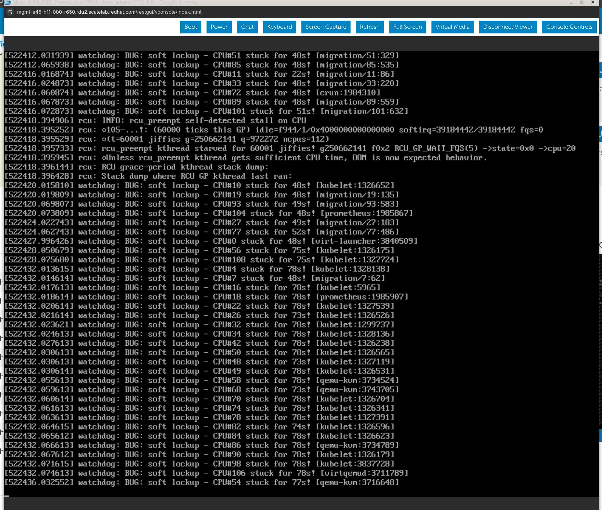

# VMs stuck at Starting

**Last Updated:** 2026-08-31

Lab note from a `virt-density-udn` workload on a 12-node mixed-hardware cluster:
**774 VMs stuck at `Starting`**, 576 `Running`, for ~24h.

## Lesson (short)

VMs stay `Starting` when the virt-launcher pod never finishes init. Here the
failure mode was **CRI-O image inspect / create timeouts** on 4 overloaded r650
nodes (~340 virt-launcher pods each). Storage and scheduling were fine.

iDRAC console on an affected r650 showed **host CPU starvation** — soft lockups
across dozens of CPUs and RCU kthread stalls — not just slow CRI-O.

A contributing factor: HCO `defaultCPUModel: Icelake-Server-v2` pinned all VMs
to those 4 nodes; r640 workers had zero VMs.

## Symptoms

```bash
oc get vm -A --no-headers | awk '{print $4}' | sort | uniq -c
# 774 Starting
# 576 Running

oc get pods -A -l kubevirt.io=virt-launcher --no-headers | awk '{print $4}' | sort | uniq -c
# 575 Running
# 390 Init:CreateContainerError
# 373 Init:ImageInspectError
```

Ruled out: unbound PVCs (0), DVs not Succeeded (0), node pressure (no
Memory/Disk/PID pressure on affected nodes).

## Root cause chain

```text
HCO defaultCPUModel (Icelake-Server-v2) → VMs only on 4 r650 workers
        ↓
~340 virt-launcher pods/node starting concurrently
        ↓
Host CPU starvation (soft lockups, RCU kthread stalls)
        ↓
CRI-O RPC timeouts (image inspect, create, GC)
        ↓
virt-launcher init containers fail
        ↓
VMI never Running → VM stays Starting
```

## Log evidence

### virt-launcher pod events (sample)

Pod `virt-density-udn-13/virt-launcher-virt-client-13-10-xlfn9`, stuck ~23h:

```text
Warning  InspectFailed  (x305 over 22h)  kubelet
  spec.initContainers{volumecontainerdisk-init}:
  Failed to inspect image "": rpc error: code = DeadlineExceeded desc = context deadline exceeded

Normal   Pulled         (x276 over 23h)  kubelet
  spec.initContainers{volumecontainerdisk-init}:
  Container image "quay.io/openshift-cnv/qe-cnv-tests-fedora:40" already present on machine

Warning  Failed         (x242 over 23h)  kubelet
  spec.initContainers{volumecontainerdisk-init}:
  Error: context deadline exceeded
```

Image is on disk; CRI-O **inspect** still times out.

### Cluster event flood

```text
Warning  InspectFailed  pod/virt-launcher-virt-client-42-23-2l72s
  Failed to inspect image "": rpc error: code = DeadlineExceeded desc = context deadline exceeded

Warning  InspectFailed  pod/virt-launcher-virt-client-36-21-5ndn4
  Failed to inspect image "": rpc error: code = DeadlineExceeded desc = stream terminated by RST_STREAM with error code: CANCEL
```

~1,587 `InspectFailed` events in recent history.

### Failing init containers

| Init container | Failures | Typical reason |
|----------------|----------|----------------|
| `volumecontainerdisk-init` | 401 | `CreateContainerError` |
| `guest-console-log` | 311 | `ImageInspectError` |
| `container-disk-binary` | 51 | mixed |

Images involved:

```text
virt-launcher-rhel9@sha256:f1645b51...   (guest-console-log, container-disk-binary, compute)
qe-cnv-tests-fedora:40                   (volumecontainerdisk-init, volumecontainerdisk)
```

### Node events — CRI-O saturated

```text
Warning  ImageGCFailed  node/e45-h14-000-r650
  rpc error: code = DeadlineExceeded desc = stream terminated by RST_STREAM with error code: CANCEL

Warning  ImageGCFailed  node/e45-h13-000-r650
  rpc error: code = DeadlineExceeded desc = context deadline exceeded
```

Affected nodes (pods / virt-launchers):

| Node | total pods | virt-launcher |
|------|------------|---------------|
| e45-h14-000-r650 | 386 | 351 |
| e45-h13-000-r650 | 377 | 344 |
| e45-h11-000-r650 | 388 | 341 |
| e34-h01-000-r650 | 372 | 319 |

### Host kernel evidence — CPU starvation

iDRAC virtual console on an overloaded **PowerEdge R650** worker during the
incident. Kubernetes `MemoryPressure` was `False`; the host was **CPU-starved**.



#### Soft lockups (many CPUs)

```text
watchdog: BUG: soft lockup - CPU#XX stuck for XXs! [process:pid]
```

40+ CPUs stuck for **22–78+ seconds**. Processes named in the lockups:

| Process | Role |
|---------|------|
| `kubelet` | Pod lifecycle, talks to CRI-O |
| `virt-launcher` | KubeVirt VM pod |
| `qemu-kvm` | VM hypervisor |
| `crun` | Container runtime (CRI-O stack) |
| `virtqemud` | libvirt on the node |
| `prometheus` | Node monitoring |
| `migration` | Kernel page migration |

When CPUs are locked up, kubelet cannot complete CRI-O RPCs — matching the
`ImageInspectError` / `DeadlineExceeded` events on virt-launcher init containers.

#### RCU stall (scheduler in trouble)

```text
rcu: INFO: rcu_preempt self-detected stall on CPU
rcu: rcu_preempt kthread starved for 60001 jiffies! g250662141 ... ->state=0x0 ->cpu=20
rcu: Unless rcu_preempt kthread gets sufficient CPU time, OOM is now expected behavior.
```

RCU grace-period kthreads starved for ~60s. This aligns with `NodeNotReady` /
`NodeUnresponsive` on e45-h13/e45-h14 and `virt-handler is not responsive` on
saturated nodes. `oc debug node/...` can hang on nodes in this state.

#### Symptom vs cause

| Layer | What you see |
|-------|----------------|
| VM | `Starting` |
| Pod | `Init:ImageInspectError` |
| Kubelet | `InspectFailed` / `DeadlineExceeded` |
| **Host (screenshot)** | **soft lockups + RCU stall** |

`node_memory_MemAvailable_bytes` can look healthy while this happens — check CPU
utilization and load, not just memory.

## CPU model scheduling (contributing factor)

CNV `defaultCPUModel` is **not** set by the workload template (`virt-density-udn`
only sets `cpu.cores`). HCO applies it cluster-wide:

```bash
oc get hco kubevirt-hyperconverged -n openshift-cnv \
  -o jsonpath='{.spec.virtualization.virtualMachineOptions.defaultCPUModel}{"\n"}'
# Icelake-Server-v2
```

virt-handler labels only nodes whose hardware supports the model:

| Workers | Hardware | `Icelake-Server-v2` | VMs |
|---------|----------|---------------------|-----|
| e34-h01, e45-h11/h13/h14 | r650 | yes | ~1,350 |
| e26-h15/h17, e29-h01/h03/h06 | r640 | no | 0 |

virt-launcher nodeSelector:

```text
cpu-model.node.kubevirt.io/Icelake-Server-v2=true
machine-type.node.kubevirt.io/pc-q35-rhel9.8.0=true
```

## Example: one VMI trace

`virt-density-udn-13/virt-client-13-10` — VM **Starting** for ~29h.

### Commands

```bash
NS=virt-density-udn-13
VM=virt-client-13-10
POD=virt-launcher-virt-client-13-10-xlfn9   # or: oc get pod -n $NS -l vm.kubevirt.io/name=$VM -o name

oc get vm  -n "$NS" "$VM" -o wide
oc get vmi -n "$NS" "$VM" -o wide
oc get pod -n "$NS" "$POD" -o wide
oc get pod -n "$NS" "$POD" -o json | jq '{init: .status.initContainerStatuses, containers: .status.containerStatuses}'
oc get events -n "$NS" --field-selector involvedObject.name="$POD" --sort-by='.lastTimestamp'
oc describe pod -n "$NS" "$POD"
```

Note: virt-launcher pods use label `vm.kubevirt.io/name=<vmi>`, not `kubevirt.io/domain`.

### Layer-by-layer status

| Object | Field | Value |
|--------|-------|-------|
| VM | `printableStatus` | `Starting` |
| VM | `Ready` | `False` — `GuestNotRunning` |
| VMI | `phase` | `Scheduling` |
| VMI | `nodeName` | `null` (stale `activePods` still points at launcher on `e45-h11`) |
| Pod | `STATUS` | `Init:ImageInspectError` (1/3 ready) |
| Pod | `node` | `e45-h11-000-r650` |

### Init container progression

```text
guest-console-log        → running (restartCount: 5)
container-disk-binary    → terminated, exit 0 (Completed)
volumecontainerdisk-init → waiting: ImageInspectError  ← STUCK HERE
compute                  → waiting: PodInitializing
volumecontainerdisk       → waiting: PodInitializing
```

Failing init inspects `quay.io/openshift-cnv/qe-cnv-tests-fedora:40` (container disk).

### Pod events (captured 2026-08-27)

```text
Warning  InspectFailed  (x411 over 28h)  kubelet  volumecontainerdisk-init:
  Failed to inspect image "": rpc error: code = DeadlineExceeded desc = context deadline exceeded

Warning  InspectFailed  (x81 over 29h)   kubelet  volumecontainerdisk-init:
  Failed to inspect image "": rpc error: code = DeadlineExceeded desc = stream terminated by RST_STREAM with error code: CANCEL

Normal   Pulled         (x316 over 29h)  kubelet  volumecontainerdisk-init:
  Container image "quay.io/openshift-cnv/qe-cnv-tests-fedora:40" already present on machine

Warning  Failed         (x280 over 29h)  kubelet  volumecontainerdisk-init:
  Error: context deadline exceeded
```

### Flow for this VMI

```text
VM Starting
  → VMI Scheduling (guest never started)
    → virt-launcher scheduled to e45-h11
      → init 1 guest-console-log: OK
      → init 2 container-disk-binary: OK
      → init 3 volumecontainerdisk-init: CRI-O ImageStatus timeout
        → compute never starts → QEMU never runs → VMI not Running → VM Starting
```

## Triage commands

```bash
# Status breakdown
oc get vm -A --no-headers | awk '{print $4}' | sort | uniq -c
oc get pods -A -l kubevirt.io=virt-launcher --no-headers | awk '{print $4}' | sort | uniq -c

# One stuck VMI (use vm.kubevirt.io/name label for launcher pod)
NS=virt-density-udn-13; VM=virt-client-13-10
oc describe vmi -n "$NS" "$VM"
POD=$(oc get pod -n "$NS" -l vm.kubevirt.io/name="$VM" -o jsonpath='{.items[0].metadata.name}')
oc describe pod -n "$NS" "$POD"
oc get events -n "$NS" --field-selector involvedObject.name="$POD" --sort-by='.lastTimestamp'

# CRI-O on overloaded node (may hang if node is saturated)
NODE=e45-h13-000-r650
oc get events -A --field-selector involvedObject.name=$NODE --sort-by='.lastTimestamp' | tail -20
oc debug node/$NODE -- chroot /host journalctl -u crio --since "2h ago" | grep -iE 'deadline|inspect|error' | tail -30

# Host kernel lockups / RCU stalls (if node responds)
oc debug node/$NODE -- chroot /host journalctl -k --since "24h ago" \
  | grep -iE 'soft lockup|rcu.*stall|watchdog'
oc debug node/$NODE -- chroot /host sh -c 'nproc; uptime'
```

Prometheus — CPU pressure on workers:

```promql
# CPU utilization per node
100 - (avg by (instance) (rate(node_cpu_seconds_total{mode="idle"}[5m])) * 100)

# Runnable tasks (load)
node_load1{instance="e45-h11-000-r650"}
```

## Recovery

| Action | Notes |
|--------|-------|
| Pause new VM creation | Stop vstorm/kube-burner until backlog clears |
| Lower `defaultCPUModel` to a model all workers support | Spreads load across 9 workers |
| Batch-delete stuck virt-launcher pods (~50/node) | Forces retry after CRI-O recovers |
| Restart CRI-O on a node | Disrupts all pods on that node — last resort |
| Reboot node in soft-lockup / RCU-stall state | May be required before kubelet/CRI-O recover |

Do **not** manually add Icelake labels to r640 nodes.

Patch example (pick model after checking r640 labels):

```bash
oc patch hco kubevirt-hyperconverged -n openshift-cnv --type=merge -p '
{
  "spec": {
    "virtualization": {
      "virtualMachineOptions": {
        "defaultCPUModel": "Cascadelake-Server-v2"
      }
    }
  }
}'
```

Existing VMIs keep their model until restarted/recreated.

### Purge stuck Pending OSD pods

After node drain / scale events, `rook-ceph-osd-*` pods can sit in **Pending**
for many hours (scheduling or stale deployment). List them and extract OSD IDs:

```bash
oc get pod -n openshift-storage | grep Pending | grep -v prepare
oc get pod -n openshift-storage | grep Pending | grep -v prepare \
  | sed -E 's/.*rook-ceph-osd-([0-9]+)-.*/\1/' | sort -n
```

Permanently remove each OSD from the cluster with the ODF CLI. When Ceph reports
the OSD is not safe to destroy, `odf purge-osd` prompts for
`yes-force-destroy-osd` — pipe it in for batch runs:

```bash
for osdnum in $(oc get pod -n openshift-storage | grep Pending | grep -v prepare \
  | sed -E 's/.*rook-ceph-osd-([0-9]+)-.*/\1/'); do
  echo yes-force-destroy-osd | odf purge-osd "$osdnum"
done
```

Verify removal (expect `cephosd: completed removal of OSD <id>` in output):

```bash
oc get deployment -n openshift-storage rook-ceph-osd-<id>
```

**Warning:** force purge bypasses PG safety checks and can cause data loss. Only
use on OSDs that are truly dead (Pending/CrashLoop, not serving data). See
[ODF purge-osd docs](https://docs.redhat.com/en/documentation/red_hat_openshift_data_foundation/4.18/html/replacing_devices/removing_osds_using_the_openshift_data_foundation_cli_tool).

## Related

- [UDN → OSD flapping](../../networking/udn-odf-osd-flapping/udn-odf-osd-flapping.md)
- [High-scale config notes](../../../labs/scale/high-scale-config-notes.md)
